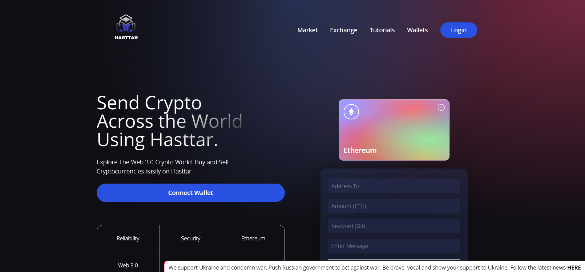

# Hasttar Web 3.0 BlockChain Application

Hasttar is my very first application that is based on web 3.0 its built using Solidity and React.js.  
The main application of the project is for connecting and storing transactions on the blockchain.
User can use this application to send or receive Ethereum.  
Along with Solidity and React.js we are also using Metamask and Ganache 
MetaMask which is nothing but a cryptocurrency wallet used to interact with the Ethereum blockchain  
and  
Ganache -Truffle Suite we are using for building our personal Ethereum blockchain which we use to run tests, execute commands, 
and inspect state while controlling how the chain operates.

## You can visit and use this website using
**https://62e3a8c2c1b4d36baf5af44f--hasttarapp.netlify.app**

Files deployed on the above site 
Marketplace : https://62e398b63bb3b35f8b3bbc54--peaceful-frangipane-db9b4b.netlify.app/

